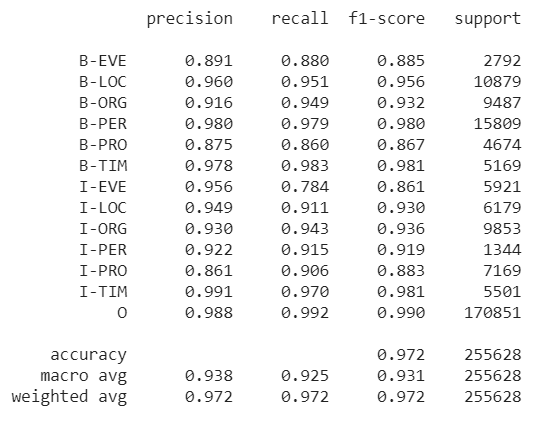

# Vietnamese-NER-with-PhoBERT
A named-entity model using PhoBERT to recognize 17 BIO entities including: person, organization, time, event, product, scoring 94% for around 20.000 testing sentences. 

If you can't view ipynb file in GitHub, using https://nbviewer.jupyter.org/ instead.

# Scoring 93% accuracy in testing dataset

